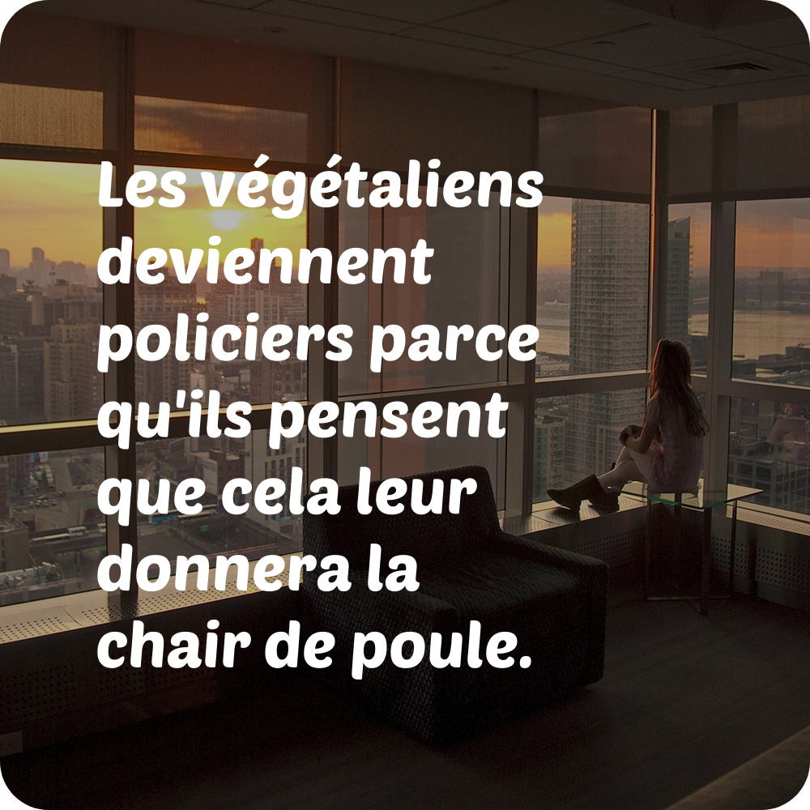
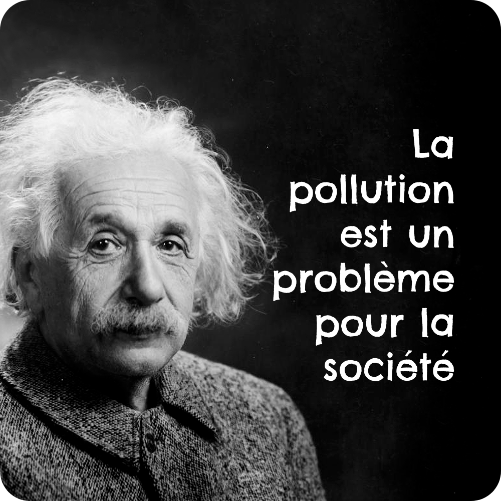
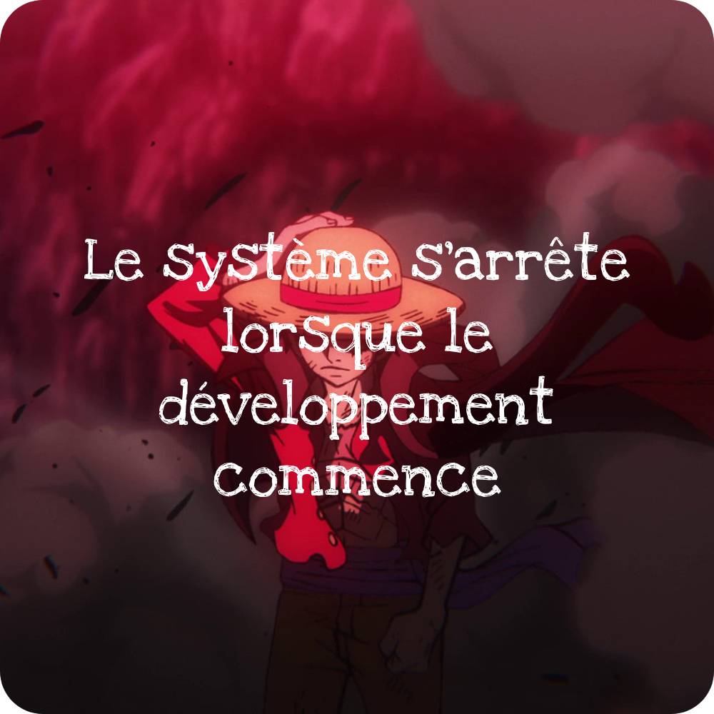
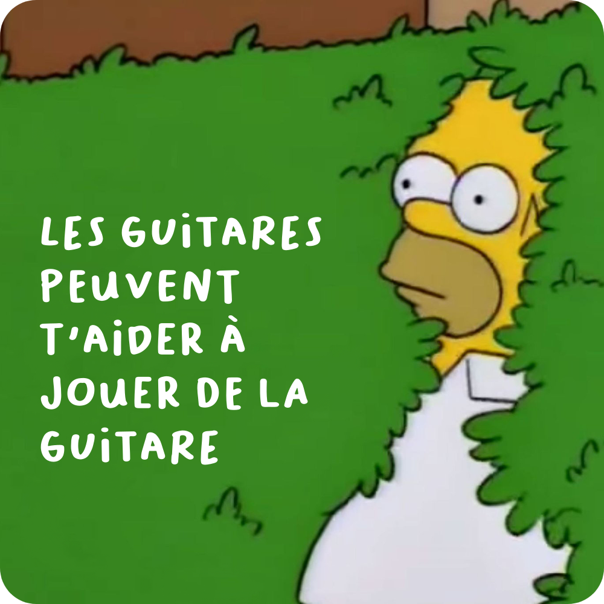

# 💭 Proverbot


<br/>

This repository contains the source code of a bot that generate random French proverb images and post them on Twitter. *(Inspired by **[InspiroBot](https://inspirobot.me/)**)*

You can see its Twitter account here: [https://twitter.com/TheProverbot](https://twitter.com/TheProverbot).

<br/>

<p align="center">
	
</p>

<br/>

# 📋 Summary

* **[📋 Summary](#-summary)**
* **[🛠️ Install](#%EF%B8%8F-install)**
* **[🧪 Tests](#-tests)**
* **[🙏 Credits](#-credits)**

<br/>

# 🛠️ Install

* Install the dependencies with:

	```shell
	$ npm install
	```

* Create folders named `data`, `generated` and `queue` in the root of the project

* Create a file named `.env` in the root of the project with the following content (see the `.env.template` file):

	```
	DEEPL_KEY=<your DeepL API key>
	TWITTER_APP_KEY=<your Twitter app key>
	TWITTER_APP_SECRET=<your Twitter app secret>
	TWITTER_ACCESS_TOKEN=<your Twitter access token>
	TWITTER_ACCESS_SECRET=<your Twitter access secret>
	```

* Copy the contents of the `example` folder in the `data` folder *(it's juste a example with only one image, one font and a few words, it's up to you to create your own data)*

* Build the project with:

	```shell
	$ npm run build
	```

* Start the project:

	* To generate 10 images:

		```shell
		$ npm run gen -- 10
		```

	* To start the bot:

		```shell
		$ npm run start
		```

<br/>

# 🧪 Tests

<p align="center">
	
</p>

<p align="center">
	
</p>

<p align="center">
	
</p>

<br/>

# 🙏 Credits

* [**Angel Uriot**](https://github.com/angeluriot) : Creator of the project.
